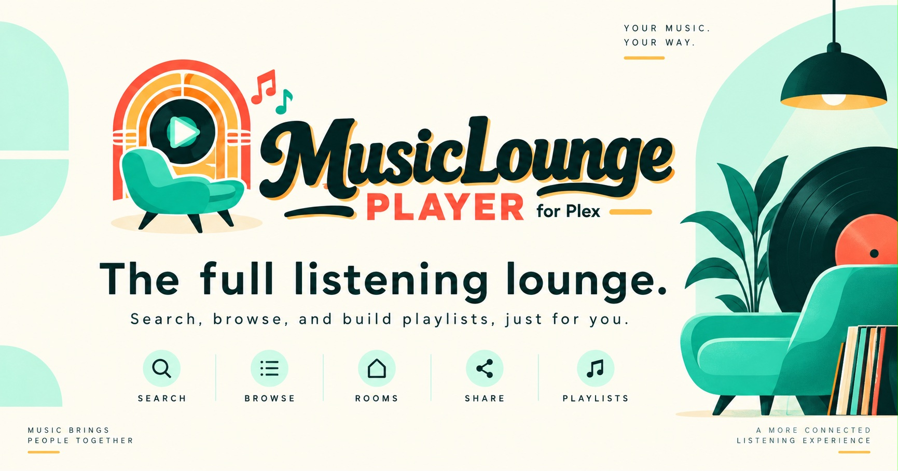

<p align="center">
  
</p>

<h1 align="center">MusicLounge Player</h1>
<p align="center"><em>The full listening lounge for Plex — search, browse, and build playlists, just for you.</em></p>

---

MusicLounge Player is a self-hosted, browser-based music player for your own Plex music library. It's built to feel like a real app — persistent playback that survives navigation, a real queue, library browsing by artist and album, native + Plex-synced playlists, Last.fm scrobbling, and installable as a home-screen PWA on iOS/Android.

It also includes two social listening modes, launched right from the player:

- **Room Mode** — start a shared listening session; guests join by code and add to one shared queue, no accounts needed.
- **Share Mode** — send a track, album, artist, or playlist as a private, time-limited link.

## Player vs. Jukebox

MusicLounge Player and [MusicLounge Jukebox](https://musiclounge.vp-fun.com) are sibling
apps under Verbena Projects. Both are free, self-hosted, and share Room Mode and Share
Mode. Player is the full listening app — personal search, browse, playlists, and a
persistent queue on top of that. Jukebox is the lite version, for when all you want is
to start a room or send a link, with no personal library browsing.

|                            | Player | Jukebox |
| -------------------------- | :----: | :-----: |
| Personal search & browse   |   ✓    |    —    |
| Playlists (native + synced)|   ✓    |    —    |
| Personal queue & transport |   ✓    |    —    |
| Room Mode                  |   ✓    |    ✓    |
| Share Mode                 |   ✓    |    ✓    |

Showcase site: [musicloungeplayer.vp-fun.com](https://musicloungeplayer.vp-fun.com)

## Features

- **Search** your whole library, with fast infinite-scroll results — a "top matches" row of album results appears above tracks when relevant
- **Browse** by Artist, Album, or Track, with sort (name, recently added, year, artist), plus an A-Z quickbar to jump straight to a letter in long lists
- **Playlists** — build native playlists, or sync existing Plex playlists (synced ones stay read-only and always current)
- **One shared "⋯" menu** on any track, album, or playlist — Play Next, Add to Queue, Add to Playlist, Start a Room, Share a Link, or (from a track) jump to its Album
- **Persistent queue** — survives page reloads and navigation, with a real editable queue view (reorder, remove, jump-to-track)
- **Recently Played**, logged automatically once a track has genuinely been listened to (skips don't count)
- **Expanded Now Playing view** — tap the mini-player for large art, a real scrub bar, full transport controls, and a proper side-by-side layout in landscape
- **Last.fm scrobbling** — connect once in Settings, then now-playing and scrobbles happen automatically
- **Room Mode** — shared queue, one now-playing, join by QR code or short code
- **Share Mode** — private links with configurable expiry, optional email delivery (with an embedded thumbnail)
- **Installable PWA** — add to your phone's home screen for a real app icon and standalone (no browser chrome) experience
- **AirPlay support** on iOS — works out of the box via Safari's own audio route picker, no extra setup
- Persistent playback across navigation — the audio never stops just because you clicked something

## Screenshots

*(Coming soon)*

## Tech stack

- **Backend:** Flask, gunicorn, SQLite (WAL mode)
- **Frontend:** Vanilla JS (no framework) — a shared playback engine (`MLPlayer`) used identically across every page, plus lightweight SPA-style navigation for uninterrupted playback within the Player/Playlists/Browse zone
- **Plex integration:** [python-plexapi](https://github.com/pkkid/python-plexapi)

## Requirements

- A running Plex Media Server with a Music library
- Python 3.12, **or** Docker/Docker Compose (Portainer-friendly)

## Getting started

### Option A — Docker / Portainer (recommended)

```bash
git clone https://github.com/earthmonkey419/musicloungeplayerforplex.git
cd musicloungeplayerforplex
cp .env.example .env
# edit .env -- at minimum set PLEX_URL, PLEX_TOKEN, ADMIN_PASSWORD, SECRET_KEY
docker compose up -d --build
```

The app will be available at `http://<host>:8680`. Config lives entirely in `.env` (see `.env.example` for every available setting, each documented) — nothing secret is baked into the image. Data (the SQLite database) persists in a named Docker volume across rebuilds.

For Portainer: create a new Stack pointing at this repo (or paste `docker-compose.yml` directly), and supply the same environment variables under the stack's environment section instead of a `.env` file.

### Option B — Manual (Python + gunicorn)

```bash
git clone https://github.com/earthmonkey419/musicloungeplayerforplex.git
cd musicloungeplayerforplex
python3.12 -m venv .venv
source .venv/bin/activate
pip install -r requirements.txt
cp config.example.py config.py
# edit config.py directly, or set the same values as environment variables
python init_db.py
gunicorn -w 1 --threads 4 --worker-class gthread -b 0.0.0.0:8680 app:app
```

A process manager (PM2, systemd, supervisord) is recommended for keeping it running — see `ecosystem.config.cjs` for a working PM2 example.

## Configuration

Every setting is documented in `config.example.py`. The essentials:

| Variable | What it's for |
|---|---|
| `PLEX_URL` | Your Plex server's URL (e.g. `http://192.168.1.x:32400`) |
| `PLEX_TOKEN` | A Plex auth token — see [Plex's own guide](https://support.plex.tv/articles/204059436-finding-an-authentication-token-x-plex-token/) |
| `MUSIC_LIB` | The name of your Music library in Plex |
| `ADMIN_PASSWORD` | The password for the single admin account this app uses |
| `SECRET_KEY` | Any long random string, used for session security |

Optional integrations (fully functional with nothing else configured; these just add more):

- **Last.fm scrobbling** — `LASTFM_API_KEY` / `LASTFM_API_SECRET` ([get a key](https://www.last.fm/api/account/create)), then connect your account once from Settings
- **MusicMind bridge** — `MUSICMIND_DB_PATH`, an optional read-only companion database. Fully optional (everything falls back to live Plex queries with no missing functionality), but when connected it meaningfully accelerates search, mood/genre browsing, and Track browsing — MusicMind's own real genre data also powers the Genres pill row on the search page.
- **SMTP** — for emailing Share Mode links directly instead of just copying them

## Architecture notes

This is a single-admin, browser-based tool — there's no multi-user account system, by design. Anyone with the admin password has full access; anyone with a Room join code or Share link gets the scoped, guest-facing experience for that session only.

## Known limitations

- **Installed PWA + backgrounding:** if you add Player to your home screen (iOS) and background it mid-queue, the *current* track keeps playing, but it won't automatically advance to the next one until you bring the app back to the foreground — confirmed to be iOS suspending the installed PWA's JavaScript more aggressively than a regular browser tab (a plain Safari/Chrome tab doesn't have this gap). If gapless background listening through a long queue matters more to you than the home-screen app feel, use it as a regular browser tab instead.

## License

MIT — see [LICENSE](LICENSE).

## Acknowledgments

Part of the [Verbena Projects](https://vp-fun.com) family of Plex tools.
